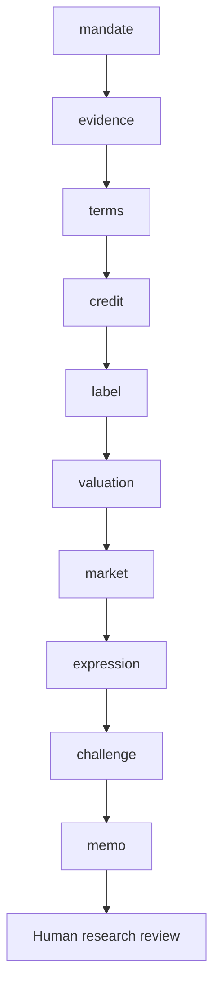

# Workflow

Does the specific bond offer acceptable credit and relative value, separately from the integrity of its label, KPI and contractual incentives?

Routes: `green-bond`, `social-bond`, `sustainability-bond`, `sustainability-linked-bond`, `transition-bond`. These named use cases share a sequential evidence/review core; they are not separately calibrated financial models.

| Step | Research task | Stage ID |
|---|---|---|
| 1 | Mandate and investable decision | `mandate` |
| 2 | Evidence intake and reconciliation | `evidence` |
| 3 | Instrument and creditor rights | `terms` |
| 4 | Underlying credit assessment | `credit` |
| 5 | Label or KPI/SPT integrity | `label` |
| 6 | Contract economics and relative value | `valuation` |
| 7 | Market context and implementation evidence | `market` |
| 8 | Investment-decision handoff | `expression` |
| 9 | Independent challenge and exceptions | `challenge` |
| 10 | Investment committee and accountable review | `memo` |

A COMPLETE artifact is structurally complete, not certified correct. Material gaps stop dependencies. Open MATERIAL/CRITICAL issues block research approval. A source-study intentionally stops after the evidence stage.
